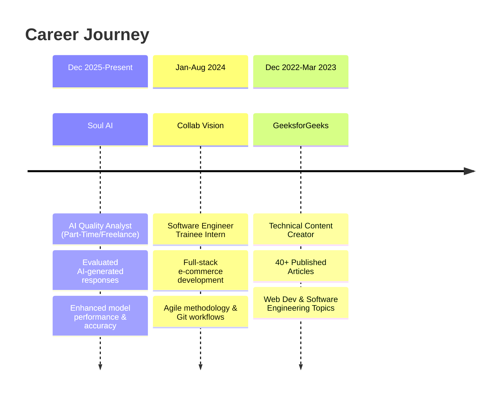

<div align="center">

<!-- Animated Header -->


<!-- Typing SVG -->
<a href="https://git.io/typing-svg"></a>

<!-- Social Badges with Animation -->
<p align="center">
  <a href="mailto:snehalmahasagar@gmail.com">
    
  </a>
  <a href="https://www.linkedin.com/in/snehal-mahasagar/">
    
  </a>
  <a href="https://github.com/Snehalmahasagar">
    
  </a>
  <a href="https://leetcode.com/u/snehalmahasagar/">
    
  </a>
  <a href="https://auth.geeksforgeeks.org/user/snehalmahasagar">
    
  </a>
</p>

<!-- Profile Views Counter -->
<p align="center">
  
  
</p>

</div>

---

## 👨‍💻 About Me


```typescript
const snehalMahasagar = {
    role: "Software Engineer & Full-Stack Developer",
    location: "Pune, Maharashtra, IN 🇮🇳",
    education: {
        degree: "B.Tech in Computer Science",
        college: "Dr. D Y Patil College of Engineering",
        cgpa: "8.59/10",
        graduation: "May 2025"
    },
    currentFocus: ["System Design", "DSA", "Scalable Architecture"],
    technologies: {
        languages: ["Java", "JavaScript", "C++"],
        frontend: ["React.js", "HTML", "CSS", "Tailwind CSS", "TypeScript"],
        backend: ["Node.js", "Express.js", "Spring Boot", "JDBC"],
        databases: ["MongoDB", "MySQL"],
        tools: ["Git", "GitHub", "VS Code", "IntelliJ IDEA", "Postman", "GCP", "Firebase"]
    },
    availability: "Open to Full-time | Remote | Hybrid in Pune",
    status: "Available for Immediate Joining ⚡"
};
```

<br clear="right"/>

- 🎓 **Computer Science Graduate** with **8.59 CGPA** from Dr. D Y Patil College of Engineering
- 🔭 Currently building **scalable full-stack applications** with React & Node.js
- 🌱 Deepening expertise in **System Design, DSA & Spring Boot**
- 💡 Passionate about **clean code**, **best practices**, and **user-focused design**
- 🤝 Active **Open Source** contributor - Hacktoberfest 2024 participant
- 📝 Published **40+ technical articles** on GeeksforGeeks
- 🏆 Earned **4 Google Arcade badges** and **10 Salesforce Trailhead badges**
- 📍 Based in **Pune** | Open for **Remote & Hybrid** opportunities
- ⚡ Fun fact: I love solving real-world problems with elegant, efficient solutions

---

## 🛠️ Tech Arsenal

<div align="center">

### Languages & Frameworks
<p>
  
</p>

### Databases & Tools
<p>
  
</p>

### Currently Learning
<p>
  
</p>

</div>

---

## 🚀 Featured Projects

<div align="center">

<!-- Project Cards -->
<table>
<tr>
<td width="50%">

### 🤖 OpenAI Article Summarizer
<a href="https://open-ai-article-summarizer-tool.vercel.app/">
  
</a>

**Tech Stack:** React.js • TypeScript • Redux Toolkit • Tailwind CSS • Firebase • OpenAI GPT-3

✨ AI-powered article summarization SaaS tool  
🔐 Firebase authentication integration  
📱 Fully responsive UI with Tailwind CSS  
⚡ Redux Toolkit for scalable state management  
🎯 Rapid API integration for enhanced functionality

</td>
<td width="50%">

### 📄 Resume Builder
<a href="https://github.com/Snehalmahasagar">
  
</a>

**Tech Stack:** HTML • CSS • JavaScript

📝 Customizable resume templates  
💾 Cross-platform compatibility  
🎨 Interactive design generator  
⚡ Lightweight and fast  
🔧 No framework dependencies

</td>
</tr>
<tr>
<td width="50%">

### 🎓 Student Course Management
<a href="https://github.com/Snehalmahasagar">
  
</a>

**Tech Stack:** Java • JDBC • MySQL

📊 Complete CRUD operations  
🗄️ Relational database schema with foreign keys  
⚡ Optimized SQL queries  
🏗️ OOP principles & modular architecture  
🛡️ Exception handling & data validation

</td>
<td width="50%">

### 🛒 E-Commerce Platform
<a href="https://github.com/Snehalmahasagar">
  
</a>

**Tech Stack:** React.js • Node.js • MongoDB • Stripe

💳 Stripe API payment integration  
🎯 30% reduction in critical bugs  
🚀 Optimized performance & scalability  
🔒 Secure authentication system  
📦 End-to-end testing & deployment

</td>
</tr>
</table>

<a href="https://github.com/Snehalmahasagar?tab=repositories">
  
</a>

</div>

---

## 💼 Professional Experience




<details>
<summary><b>🔍 Click to expand experience details</b></summary>

<br>

### 🤖 AI Quality Analyst (Part-Time/Freelance) — *Soul AI* | Present
- 📊 Evaluated AI-generated responses for **accuracy, relevance, and adherence** to task guidelines
- 🔍 Reviewed system outputs to ensure **consistency, clarity, and alignment** with user intent
- 💡 Provided **structured feedback** to improve response quality and overall model performance
- 🎯 Contributed to **continuous improvement** of AI model capabilities

### 💻 Software Engineer Trainee Intern — *Collab Vision Infosolutions* | Jan-Aug 2024
- 🚀 Engineered a **full-stack e-commerce web application** using React.js, Node.js, and MongoDB
- ⚡ Improved site **performance and scalability** through optimized architecture
- 💳 Integrated **Stripe API** for secure payment processing, reducing checkout time
- 🔧 Managed **version control** through Git and GitHub, ensuring smooth release cycles
- 🧪 Collaborated in an **Agile team** environment to perform end-to-end testing
- 🐛 Reduced **critical bugs by 30%** through systematic debugging and optimization

### ✍️ Technical Content Creator — *GeeksforGeeks* | Dec 2022-Mar 2023
- 📝 Authored **40+ paid technical articles** on software engineering topics
- 🌐 **Topics covered:** Web Technologies, Software Development, Oracle, SAP, Technical Documentation
- 📚 **Specializations:** Agile Development, Code Quality, Best Practices
- 👥 Helped **thousands of developers** learn and grow through quality content
- 🎯 Maintained **high editorial standards** and technical accuracy

</details>

---

## 🏆 Achievements & Badges

<div align="center">

### 🧠 LeetCode Progress
<p>
  
</p>

<p>
  
  
</p>

### 🎃 Hacktoberfest 2025


### 🎮 Google Arcade


### ☁️ Salesforce Trailhead


### 📚 GeeksforGeeks


### 📊 Kaggle


### 🎖️ Holopin Board
[](https://holopin.io/@snehalmarutisalokhe)

</div>

---

## 📊 GitHub Analytics

<div align="center">
  
  
</div>

<div align="center">
  
</div>

<div align="center">
  
</div>

---

## 🎓 Education

<div align="center">

| 🎓 Degree | 🏛️ Institution | 📅 Duration | 📊 Performance |
|-----------|----------------|-------------|----------------|
| **B.Tech (Computer Science)** | Dr. D Y Patil Prathisthan's College of Engineering, Kolhapur | 2021 - May 2025 | **CGPA: 8.59/10** |
| **HSC (12th)** | Walchand College of Arts and Science, Solapur | 2019 - 2021 | **91.33%** |
| **SSC (10th)** | Gandhi Natha Rangji Vidyalaya, Solapur | 2018 - 2019 | **89.20%** |

</div>

---

## 🎯 Current Goals for 2026

```javascript
const goals2025 = {
    technical: [
        "Master System Design & Advanced DSA",
        "Build 5+ production-ready full-stack applications",
        "Contribute to 15+ open source projects",
        "Achieve 300+ LeetCode problems solved",
        "Deep dive into Spring Boot & Microservices"
    ],
    professional: [
        "Land a full-time Software Engineer role in Pune",
        "Work on impactful real-world projects",
        "Mentor junior developers & contribute to community",
        "Publish 50+ technical articles & tutorials"
    ],
    learning: [
        "Docker & Kubernetes containerization",
        "AWS Cloud Services & DevOps practices",
        "Advanced React patterns & performance optimization",
        "System Design & Scalable Architecture"
    ],
    community: [
        "Maintain consistent GitHub contributions (500+ commits)",
        "Build a strong developer network",
        "Share knowledge through blogging & content creation",
        "Participate in hackathons & coding competitions"
    ]
};

console.log("Let's make 2025 amazing! 🚀");
```

---

## 📈 Weekly Coding Activity

<div align="center">

<!--START_SECTION:waka-->
<!--END_SECTION:waka-->


</div>

---

## 💡 What I'm Working On

<div align="center">

| 🔨 Current Projects | 🌱 Learning | 📚 Reading |
|---------------------|-------------|-----------|
| Full-stack E-commerce Platform | System Design Patterns | Designing Data-Intensive Applications |
| Spring Boot Microservices | Docker & Kubernetes | Clean Code by Robert Martin |
| LeetCode Daily Challenges | AWS Cloud Services | Head First Design Patterns |

</div>

---

## 🤝 Let's Connect!

<div align="center">


### 💬 Open to collaborations, job opportunities, and tech discussions!

<p>
  <a href="mailto:snehalmahasagar@gmail.com">
    
  </a>
  <a href="https://www.linkedin.com/in/snehal-mahasagar/">
    
  </a>
  <a href="https://leetcode.com/u/snehalmahasagar/">
    
  </a>
</p>

### 📍 Based in Pune, Maharashtra | Open for Remote & Hybrid Opportunities
### ⚡ Available for Immediate Joining

---

### ⭐ If you find my work interesting, consider starring my repositories!


</div>

---

<div align="center">

**"Building scalable, user-focused web applications with clean and maintainable code"**


</div>
